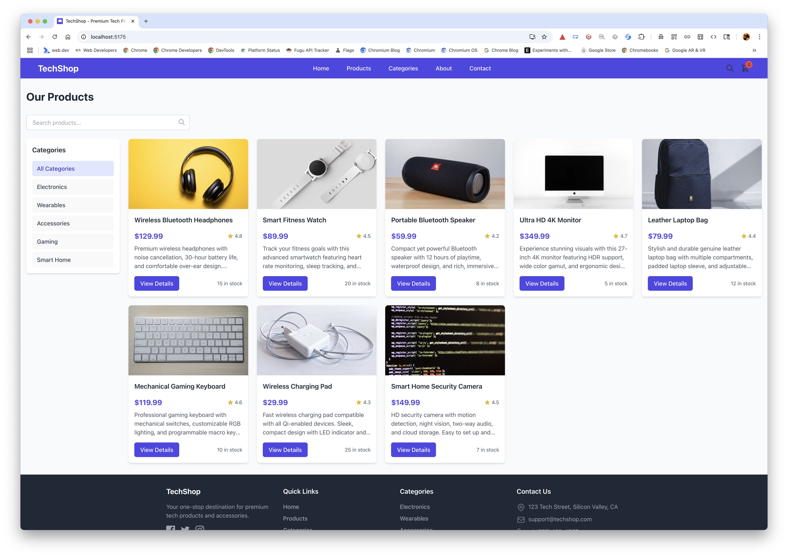
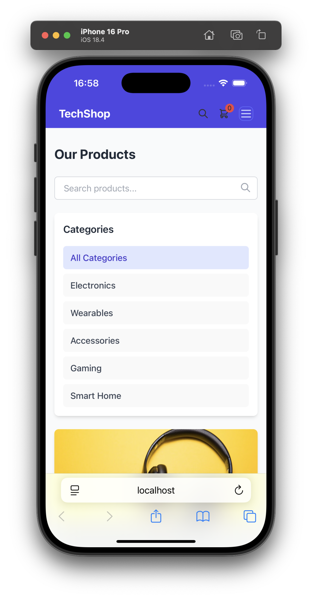
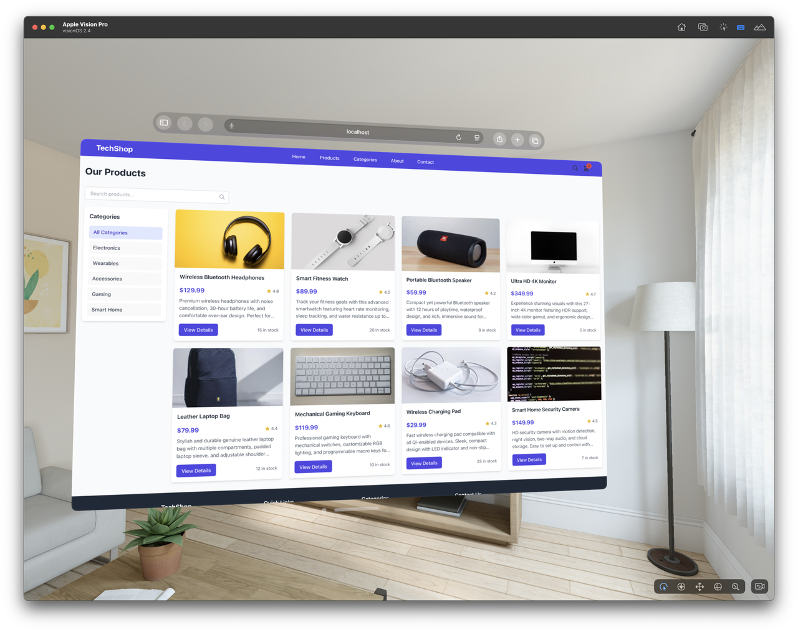
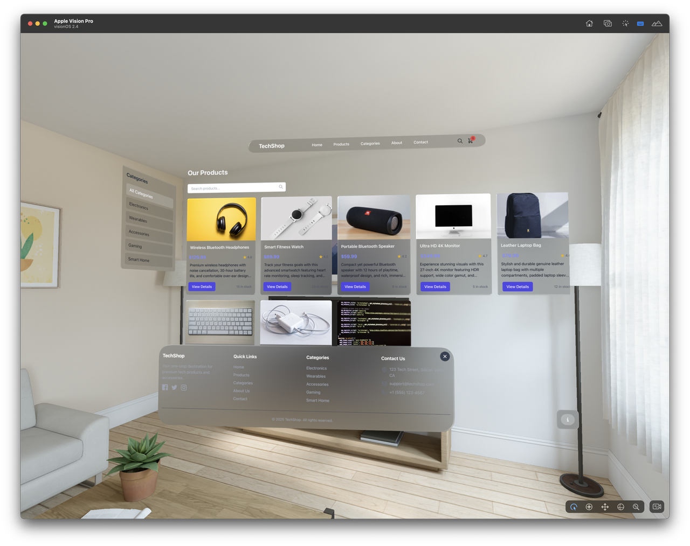

<div align="center">
  

Make the Web Spatial Too

</div>

# TechShop Demo for WebSpatial

This demo explores and showcases the possibilities of spatializing a real-world e-commerce site’s GUI.


|           Large Screen           |          Small Window          |
| :------------------------------: | :----------------------------: |
|  |  |

|             Phone              |            Tablet            |
| :----------------------------: | :--------------------------: |
|  |  |

|         visionOS Safari         |            WebSpatial            |
| :-----------------------------: | :------------------------------: |
|  |  |

## WebSpatial Documentation

- [Table of Contents](https://webspatial.dev/docs)
- [Introduction](https://webspatial.dev/docs/introduction)
- [Quick Example](https://webspatial.dev/docs/quick-example)
- [Core Concepts](https://webspatial.dev/docs/core-concepts)
- [Development Guide](https://webspatial.dev/docs/development-guide)

## Setup

Run this command to reinstall dependencies after cloning or updating the repository:

```bash
pnpm install:clean
```

Install the following tools globally:

1. Xcode
2. visionOS simulator
<!-- 3. `pnpm add -g @webspatial/builder` -->

Then, create a `.env.local` file:

```bash
cp .env.example .env.local
```

## Development

### Only For Desktop/Mobile Platforms

```bash
pnpm dev
```

> Ensure the environment variable `XR_ENV` is empty when running this dev server

### For Both Desktop/Mobile Platforms and visionOS

#### Step 1: Web Build Tool

Option A: open two terminals and run these two commands in each one:

```bash
pnpm dev
```

```bash
pnpm dev:avp
```

> This environment-variable-enabled devserver can coexist with the devserver for desktop/mobile, using different ports and base automatically.

Option B: open one terminal and run this all-in-one command:

```bash
pnpm dev:all
```

#### Step 2: WebSpatial Builder

Fill in the `$XR_DEV_SERVER` in the .env.local file.

```bash
XR_DEV_SERVER=http://localhost:[port from `pnpm dev:avp`]/webspatial/avp/
XR_PRE_SERVER=
XR_PROD_SERVER=
```

Then:

```bash
pnpm run:avp
```
